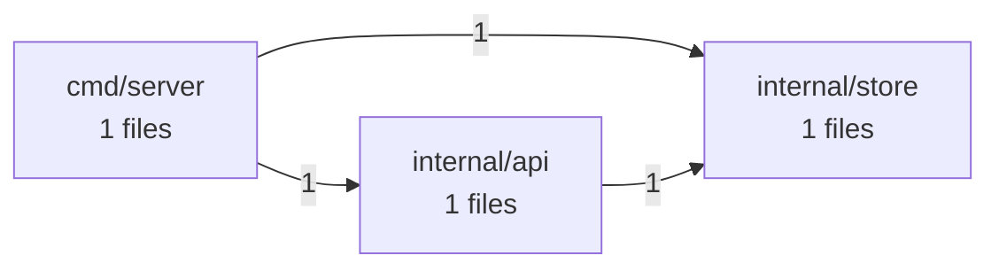

# Software X-Ray: go-service

> go-service: 3 critical/high finding(s) in Security, Technology Currency. Start there.

- **Target:** repository (`capybari-fixtures/go-service`)
- **Scan:** `scn_d147a9afc5156013` · 2026-09-24 04:52 UTC · 3.0s
- **Tool:** capybari 0136b2b
- **Mode:** online

## Scores

_All scores: 0 = worst, 100 = best._

| Dimension | Score | Rating | Confidence | Summary |
|---|---:|---|---|---|
| AI Dependability | **100** | good | low | No issues found by ai-signals. |
| Dependency Hygiene | **100** | good | high | No issues found by dependencies. |
| Technology Currency | **77** | fair | high | 1 high finding(s) by tech-detect. |
| Maintainability | **100** | good | high | No issues found by code-health. |
| Operability | **98** | good | high | 1 low finding(s) by fingerprint. |
| Security | **60** | fair | high | 2 high, 1 medium finding(s) by secrets, vulns. |
| Structure | **100** | good | high | No issues found by architecture. |

## What is it?

- **Project type:** application, web-backend
- **Primary language:** Go
- **Package managers:** Go modules
- **Runtimes:** Go 1.19
- **Entry points:** cmd/server/
- **Tests:** yes · **CI:** none · **Containers:** no · **Docs:** no
- **Size:** tiny · **Fingerprint:** `fp_0c1251ef491bd3718493`
- **Files:** 6 (85 lines) · **Languages:** Go 100%
- **Technologies:** Go 1.19, Gin 1.7.0
- **Dependencies:** 3 packages from 1 manifest(s), 3 direct

### Architecture

## Findings

Critical **0** · High **3** · Medium **1** · Low **1** · Info **0**

| Severity | Confidence | Dimension | Finding | Location | Capability |
|---|---|---|---|---|---|
| high | high | evolution | Go 1.19 is end-of-life |  | tech-detect |
| high | high | security | github.com/gin-gonic/gin 1.7.0 has 5 known vulnerabilities | `go.mod` | vulns |
| high | high | security | golang.org/x/text 0.3.5 has 5 known vulnerabilities | `go.mod` | vulns |
| medium | medium | security | stdlib 1.19 has 97 known vulnerabilities | `go.mod` | vulns |
| low | high | operability | No README |  | fingerprint |

### Details

#### Go 1.19 is end-of-life `CSI-aebfe9feb75da0e0`

**high** severity · **high** confidence · evolution/end-of-life · found by `tech-detect`

Go 1.19 (release line 1.19) reached end-of-life on 2023-08-08. It no longer receives security fixes, so known vulnerabilities in it stay unpatched. Each Go release is supported until two newer major releases exist.

**Rule:** eol-go — https://endoflife.date/go

**Remediation:** Upgrade Go to a supported release line (see https://endoflife.date/go) and test the application against it.

_False positive?_ If the declared version is only a minimum (e.g. >=12) and production runs a newer release, update the declaration to match.

#### github.com/gin-gonic/gin 1.7.0 has 5 known vulnerabilities `CSI-7bcc538ccacbac9c`

**high** severity · **high** confidence · security/vulnerability · found by `vulns` (engine: OSV.dev)

- GHSA-h395-qcrw-5vmq (high, CVSS 7.1) CVE-2020-28483, GO-2021-0052: Inconsistent Interpretation of HTTP Requests in github.com/gin-gonic/gin
- GHSA-3vp4-m3rf-835h (medium, CVSS 5.6) CVE-2023-26125: Improper input validation in github.com/gin-gonic/gin
- GHSA-2c4m-59x9-fr2g (medium, CVSS 4.3) CVE-2023-29401, GO-2023-1737: Gin Web Framework does not properly sanitize filename parameter of Context.FileAttachment function
- GO-2021-0052 (medium) CVE-2020-28483, GHSA-h395-qcrw-5vmq: Inconsistent interpretation of HTTP Requests in github.com/gin-gonic/gin
- GO-2023-1737 (medium) CVE-2023-29401, GHSA-2c4m-59x9-fr2g: Improper handling of filenames in Content-Disposition HTTP header in github.com/gin-gonic/gin

- go.mod — resolves github.com/gin-gonic/gin 1.7.0

**Rule:** GHSA-h395-qcrw-5vmq — https://osv.dev/vulnerability/GHSA-h395-qcrw-5vmq, https://osv.dev/vulnerability/GHSA-3vp4-m3rf-835h, https://osv.dev/vulnerability/GHSA-2c4m-59x9-fr2g, https://osv.dev/vulnerability/GO-2021-0052, https://osv.dev/vulnerability/GO-2023-1737, https://nvd.nist.gov/vuln/detail/CVE-2020-28483

**Remediation:** Upgrade github.com/gin-gonic/gin to 1.9.1 or later and re-run the tests.

_False positive?_ Advisories match on version only. Check whether the vulnerable function is reachable in this application before deprioritising.

#### golang.org/x/text 0.3.5 has 5 known vulnerabilities `CSI-6b7027191989a3ed`

**high** severity · **high** confidence · security/vulnerability · found by `vulns` (engine: OSV.dev)

- GHSA-69ch-w2m2-3vjp (high, CVSS 7.5) CVE-2022-32149, GO-2022-1059: golang.org/x/text/language Denial of service via crafted Accept-Language header
- GHSA-ppp9-7jff-5vj2 (high, CVSS 7.5) CVE-2021-38561, GO-2021-0113: golang.org/x/text/language Out-of-bounds Read vulnerability
- GO-2021-0113 (medium) CVE-2021-38561, GHSA-ppp9-7jff-5vj2: Out-of-bounds read in golang.org/x/text/language
- GO-2022-1059 (medium) CVE-2022-32149, GHSA-69ch-w2m2-3vjp: Denial of service via crafted Accept-Language header in golang.org/x/text/language
- GO-2026-5970 (medium) CVE-2026-56852: Infinite loop on invalid input in golang.org/x/text

- go.mod — resolves golang.org/x/text 0.3.5

**Rule:** GHSA-69ch-w2m2-3vjp — https://osv.dev/vulnerability/GHSA-69ch-w2m2-3vjp, https://osv.dev/vulnerability/GHSA-ppp9-7jff-5vj2, https://osv.dev/vulnerability/GO-2021-0113, https://osv.dev/vulnerability/GO-2022-1059, https://osv.dev/vulnerability/GO-2026-5970, https://nvd.nist.gov/vuln/detail/CVE-2022-32149

**Remediation:** Upgrade golang.org/x/text to 0.39.0 or later and re-run the tests.

_False positive?_ Advisories match on version only. Check whether the vulnerable function is reachable in this application before deprioritising.

#### stdlib 1.19 has 97 known vulnerabilities `CSI-013dcba0845e2ea1`

**medium** severity · **medium** confidence · security/vulnerability · found by `vulns` (engine: OSV.dev)

- GO-2022-0969 (medium) BIT-golang-2022-27664, CVE-2022-27664: Denial of service in net/http and golang.org/x/net/http2
- GO-2022-0988 (medium) BIT-golang-2022-32190, CVE-2022-32190: Failure to strip relative path components in net/url
- GO-2022-1037 (medium) BIT-golang-2022-2879, CVE-2022-2879: Unbounded memory consumption when reading headers in archive/tar
- GO-2022-1038 (medium) BIT-golang-2022-2880, CVE-2022-2880: Incorrect sanitization of forwarded query parameters in net/http/httputil
- GO-2022-1039 (medium) BIT-golang-2022-41715, CVE-2022-41715: Memory exhaustion when compiling regular expressions in regexp/syntax
- GO-2022-1095 (medium) BIT-golang-2022-41716, CVE-2022-41716: Unsanitized NUL in environment variables on Windows in syscall and os/exec
- GO-2022-1143 (medium) BIT-golang-2022-41720, CVE-2022-41720: Restricted file access on Windows in os and net/http
- GO-2022-1144 (medium) BIT-golang-2022-41717, CVE-2022-41717: Excessive memory growth in net/http and golang.org/x/net/http2
- GO-2023-1568 (medium) BIT-golang-2022-41722, CVE-2022-41722: Path traversal on Windows in path/filepath
- GO-2023-1569 (medium) BIT-golang-2022-41725, CVE-2022-41725: Excessive resource consumption in mime/multipart
- GO-2023-1570 (medium) BIT-golang-2022-41724, CVE-2022-41724: Panic on large handshake records in crypto/tls
- GO-2023-1571 (medium) BIT-golang-2022-41723, CVE-2022-41723: Denial of service via crafted HTTP/2 stream in net/http and golang.org/x/net
- GO-2023-1621 (medium) BIT-golang-2023-24532, CVE-2023-24532: Incorrect calculation on P256 curves in crypto/internal/nistec
- GO-2023-1702 (medium) BIT-golang-2023-24537, CVE-2023-24537: Infinite loop in parsing in go/scanner
- GO-2023-1703 (medium) BIT-golang-2023-24538, CVE-2023-24538: Backticks not treated as string delimiters in html/template
- GO-2023-1704 (medium) BIT-golang-2023-24534, CVE-2023-24534: Excessive memory allocation in net/http and net/textproto
- GO-2023-1705 (medium) BIT-golang-2023-24536, CVE-2023-24536: Excessive resource consumption in net/http, net/textproto and mime/multipart
- GO-2023-1751 (medium) BIT-golang-2023-24539, CVE-2023-24539: Improper sanitization of CSS values in html/template
- GO-2023-1752 (medium) BIT-golang-2023-24540, CVE-2023-24540: Improper handling of JavaScript whitespace in html/template
- GO-2023-1753 (medium) BIT-golang-2023-29400, CVE-2023-29400: Improper handling of empty HTML attributes in html/template
- GO-2023-1840 (medium) BIT-golang-2023-29403, CVE-2023-29403: Unsafe behavior in setuid/setgid binaries in runtime
- GO-2023-1878 (medium) BIT-golang-2023-29406, CVE-2023-29406: Insufficient sanitization of Host header in net/http
- GO-2023-1987 (medium) BIT-golang-2023-29409, CVE-2023-29409: Large RSA keys can cause high CPU usage in crypto/tls
- GO-2023-2041 (medium) BIT-golang-2023-39318, CVE-2023-39318: Improper handling of HTML-like comments in script contexts in html/template
- GO-2023-2043 (medium) BIT-golang-2023-39319, CVE-2023-39319: Improper handling of special tags within script contexts in html/template
- GO-2023-2102 (medium) BIT-golang-2023-39325, CVE-2023-39325: HTTP/2 rapid reset can cause excessive work in net/http
- GO-2023-2185 (medium) BIT-golang-2023-45283, CVE-2023-45283: Insecure parsing of Windows paths with a \??\ prefix in path/filepath
- GO-2023-2186 (medium) BIT-golang-2023-45284, CVE-2023-45284: Incorrect detection of reserved device names on Windows in path/filepath
- GO-2023-2375 (medium) BIT-golang-2023-45287, CVE-2023-45287: Before Go 1.20, the RSA based key exchange methods in crypto/tls may exhibit a timing side channel
- GO-2023-2382 (medium) BIT-golang-2023-39326, CVE-2023-39326: Denial of service via chunk extensions in net/http
- GO-2024-2598 (medium) BIT-golang-2024-24783, CVE-2024-24783: Verify panics on certificates with an unknown public key algorithm in crypto/x509
- GO-2024-2599 (medium) BIT-golang-2023-45290, CVE-2023-45290: Memory exhaustion in multipart form parsing in net/textproto and net/http
- GO-2024-2600 (medium) BIT-golang-2023-45289, CVE-2023-45289: Incorrect forwarding of sensitive headers and cookies on HTTP redirect in net/http
- GO-2024-2609 (medium) BIT-golang-2024-24784, CVE-2024-24784: Comments in display names are incorrectly handled in net/mail
- GO-2024-2610 (medium) BIT-golang-2024-24785, CVE-2024-24785: Errors returned from JSON marshaling may break template escaping in html/template
- GO-2024-2687 (medium) BIT-golang-2023-45288, CVE-2023-45288: HTTP/2 CONTINUATION flood in net/http
- GO-2024-2887 (medium) BIT-golang-2024-24790, CVE-2024-24790: Unexpected behavior from Is methods for IPv4-mapped IPv6 addresses in net/netip
- GO-2024-2888 (medium) BIT-golang-2024-24789, CVE-2024-24789: Mishandling of corrupt central directory record in archive/zip
- GO-2024-2963 (medium) BIT-golang-2024-24791, CVE-2024-24791: Denial of service due to improper 100-continue handling in net/http
- GO-2024-3105 (medium) BIT-golang-2024-34155, CVE-2024-34155: Stack exhaustion in all Parse functions in go/parser
- GO-2024-3106 (medium) BIT-golang-2024-34156, CVE-2024-34156: Stack exhaustion in Decoder.Decode in encoding/gob
- GO-2024-3107 (medium) BIT-golang-2024-34158, CVE-2024-34158: Stack exhaustion in Parse in go/build/constraint
- GO-2025-3373 (medium) BIT-golang-2024-45341, CVE-2024-45341: Usage of IPv6 zone IDs can bypass URI name constraints in crypto/x509
- GO-2025-3420 (medium) BIT-golang-2024-45336, CVE-2024-45336: Sensitive headers incorrectly sent after cross-domain redirect in net/http
- GO-2025-3447 (medium) BIT-golang-2025-22866, CVE-2025-22866: Timing sidechannel for P-256 on ppc64le in crypto/internal/nistec
- GO-2025-3503 (medium) CVE-2025-22870, GHSA-qxp5-gwg8-xv66: HTTP Proxy bypass using IPv6 Zone IDs in golang.org/x/net
- GO-2025-3563 (medium) BIT-golang-2025-22871, CVE-2025-22871: Request smuggling due to acceptance of invalid chunked data in net/http
- GO-2025-3750 (medium) BIT-golang-2025-0913, CVE-2025-0913: Inconsistent handling of O_CREATE|O_EXCL on Unix and Windows in os in syscall
- GO-2025-3751 (medium) BIT-golang-2025-4673, CVE-2025-4673: Sensitive headers not cleared on cross-origin redirect in net/http
- GO-2025-3849 (medium) BIT-golang-2025-47907, CVE-2025-47907: Incorrect results returned from Rows.Scan in database/sql
- GO-2025-3956 (medium) BIT-golang-2025-47906, CVE-2025-47906: Unexpected paths returned from LookPath in os/exec
- GO-2025-4006 (medium) BIT-golang-2025-61725, CVE-2025-61725: Excessive CPU consumption in ParseAddress in net/mail
- GO-2025-4007 (medium) BIT-golang-2025-58187, CVE-2025-58187: Quadratic complexity when checking name constraints in crypto/x509
- GO-2025-4008 (medium) BIT-golang-2025-58189, CVE-2025-58189: ALPN negotiation error contains attacker controlled information in crypto/tls
- GO-2025-4009 (medium) BIT-golang-2025-61723, CVE-2025-61723: Quadratic complexity when parsing some invalid inputs in encoding/pem
- GO-2025-4010 (medium) BIT-golang-2025-47912, CVE-2025-47912: Insufficient validation of bracketed IPv6 hostnames in net/url
- GO-2025-4011 (medium) BIT-golang-2025-58185, CVE-2025-58185: Parsing DER payload can cause memory exhaustion in encoding/asn1
- GO-2025-4012 (medium) BIT-golang-2025-58186, CVE-2025-58186: Lack of limit when parsing cookies can cause memory exhaustion in net/http
- GO-2025-4013 (medium) BIT-golang-2025-58188, CVE-2025-58188: Panic when validating certificates with DSA public keys in crypto/x509
- GO-2025-4014 (medium) BIT-golang-2025-58183, CVE-2025-58183: Unbounded allocation when parsing GNU sparse map in archive/tar
- GO-2025-4015 (medium) BIT-golang-2025-61724, CVE-2025-61724: Excessive CPU consumption in Reader.ReadResponse in net/textproto
- GO-2025-4155 (medium) BIT-golang-2025-61729, CVE-2025-61729: Excessive resource consumption when printing error string for host certificate validation in crypto/x509
- GO-2025-4175 (medium) BIT-golang-2025-61727, CVE-2025-61727: Improper application of excluded DNS name constraints when verifying wildcard names in crypto/x509
- GO-2026-4337 (medium) BIT-golang-2025-68121, CVE-2025-68121: Unexpected session resumption in crypto/tls
- GO-2026-4340 (medium) BIT-golang-2025-61730, CVE-2025-61730: Handshake messages may be processed at the incorrect encryption level in crypto/tls
- GO-2026-4341 (medium) BIT-golang-2025-61726, CVE-2025-61726: Memory exhaustion in query parameter parsing in net/url
- GO-2026-4342 (medium) BIT-golang-2025-61728, CVE-2025-61728: Excessive CPU consumption when building archive index in archive/zip
- GO-2026-4403 (medium) BIT-golang-2025-22873, CVE-2025-22873: Improper access to parent directory of root in os
- GO-2026-4601 (medium) BIT-golang-2026-25679, CVE-2026-25679: Incorrect parsing of IPv6 host literals in net/url
- GO-2026-4602 (medium) BIT-golang-2026-27139, CVE-2026-27139: FileInfo can escape from a Root in os
- GO-2026-4603 (medium) BIT-golang-2026-27142, CVE-2026-27142: URLs in meta content attribute actions are not escaped in html/template
- GO-2026-4864 (medium) BIT-golang-2026-32282, CVE-2026-32282: TOCTOU permits root escape on Linux via Root.Chmod in os in internal/syscall/unix
- GO-2026-4865 (medium) BIT-golang-2026-32289, CVE-2026-32289: JsBraceDepth Context Tracking Bugs (XSS) in html/template
- GO-2026-4869 (medium) BIT-golang-2026-32288, CVE-2026-32288: Unbounded allocation for old GNU sparse in archive/tar
- GO-2026-4870 (medium) BIT-golang-2026-32283, CVE-2026-32283: Unauthenticated TLS 1.3 KeyUpdate record can cause persistent connection retention and DoS in crypto/tls
- GO-2026-4918 (medium) BIT-golang-2026-33814, CVE-2026-33814: Infinite loop in HTTP/2 transport when given bad SETTINGS_MAX_FRAME_SIZE in net/http/internal/http2 in golang.org/x/net
- GO-2026-4946 (medium) BIT-golang-2026-32281, CVE-2026-32281: Inefficient policy validation in crypto/x509
- GO-2026-4947 (medium) BIT-golang-2026-32280, CVE-2026-32280: Unexpected work during chain building in crypto/x509
- GO-2026-4970 (medium) BIT-golang-2026-39822, CVE-2026-39822: Root escape via symlink plus trailing slash in os
- GO-2026-4971 (medium) BIT-golang-2026-39836, CVE-2026-39836: Panic in Dial and LookupPort when handling NUL byte on Windows in net
- GO-2026-4976 (medium) BIT-golang-2026-39825, CVE-2026-39825: ReverseProxy forwards queries with more than urlmaxqueryparams parameters in net/http/httputil
- GO-2026-4977 (medium) BIT-golang-2026-42499, CVE-2026-42499: Quadratic string concatenation in consumePhrase in net/mail
- GO-2026-4980 (medium) BIT-golang-2026-39826, CVE-2026-39826: Escaper bypass leads to XSS in html/template
- GO-2026-4981 (medium) BIT-golang-2026-33811, CVE-2026-33811: Crash when handling long CNAME response in net
- GO-2026-4982 (medium) BIT-golang-2026-39823, CVE-2026-39823: Bypass of meta content URL escaping causes XSS in html/template
- GO-2026-4986 (medium) BIT-golang-2026-39820, CVE-2026-39820: Quadratic string concatentation in consumeComment in net/mail
- GO-2026-5026 (medium) CVE-2026-39821: Invoking failure to reject ASCII-only Punycode-encoded labels in golang.org/x/net/idna
- GO-2026-5037 (medium) BIT-golang-2026-27145, CVE-2026-27145: Inefficient candidate hostname parsing in crypto/x509
- GO-2026-5038 (medium) BIT-golang-2026-42504, CVE-2026-42504: Quadratic complexity in WordDecoder.DecodeHeader in mime
- GO-2026-5039 (medium) BIT-golang-2026-42507, CVE-2026-42507: Arbitrary inputs are included in errors without any escaping in net/textproto
- GO-2026-5856 (medium) BIT-golang-2026-42505, CVE-2026-42505: Invoking Encrypted Client Hello privacy leak in crypto/tls
- GO-2026-5972 (medium) BIT-golang-2026-33818, CVE-2026-33818: Enforce maximum recursion depth in encoding/asn1
- GO-2026-6088 (medium) BIT-golang-2026-56859, CVE-2026-56859: Add recursion depth guard during decode in encoding/xml
- GO-2026-6089 (medium) BIT-golang-2026-56853, CVE-2026-56853: Apply ReadHeaderTimeout when doing unencrypted HTTP/2 check in net/http
- GO-2026-6090 (medium) BIT-golang-2026-56862, CVE-2026-56862: Limit handshake messages we are willing to accept post-handshake in crypto/tls
- GO-2026-6091 (medium) BIT-golang-2026-56858, CVE-2026-56858: Fix Javascript regexp context tracking in html/template
- GO-2026-6218 (medium) BIT-golang-2026-56860, CVE-2026-56860: Avoid quadratic complexity in resolvePath in net/url

- go.mod — resolves stdlib 1.19

**Rule:** GO-2022-0969 — https://osv.dev/vulnerability/GO-2022-0969, https://osv.dev/vulnerability/GO-2022-0988, https://osv.dev/vulnerability/GO-2022-1037, https://osv.dev/vulnerability/GO-2022-1038, https://osv.dev/vulnerability/GO-2022-1039, https://groups.google.com/g/golang-announce/c/x49AQzIVX-s

**Remediation:** Upgrade stdlib to 1.25.13 or later and re-run the tests.

_False positive?_ Advisories match on version only. Check whether the vulnerable function is reachable in this application before deprioritising.

#### No README `CSI-e4020edf7aba62cb`

**low** severity · **high** confidence · operability/missing-readme · found by `fingerprint`

There is no README explaining what the project is, how to build it and how to run it.

**Rule:** no-readme

**Remediation:** Add a README with purpose, setup, build, test and deployment instructions.

## What else can we tell you?

1. **Add the deployed URL**: The repository shows the code. The deployed URL adds external exposure, TLS and security-header checks of what users actually reach.

## Capabilities run

| Capability | Status | Findings | Time | Network | Notes |
|---|---|---:|---:|---|---|
| AI-Generation Signals _(experimental)_ `ai-signals@0.1.0` | ok | 0 | 0ms | none | 0 AI assistant config(s), 0 builder marker(s), 0 scaffolding comment(s) |
| Architecture Mapper `architecture@0.1.0` | ok | 0 | 13ms | none | 3 modules, 3 internal dependencies, 0 cycle(s), 1 external packages |
| Code Health `code-health@0.1.0` | ok | 0 | 15ms | none | 4 functions in 3 files; avg complexity 1.3, max 2; 0.0% duplicated; 0 hotspot(s) |
| Dependency Inventory & SBOM `dependencies@0.1.0` | ok | 0 | 0ms | none | 3 packages (3 direct) from 1 manifest(s): Go 3 |
| Project Fingerprint `fingerprint@0.1.0` | ok | 1 | 5ms | none | application/web-backend project in Go on Go 1.19 |
| Repository Inventory `inventory@0.1.0` | ok | 0 | 1ms | none | 6 files, 85 lines, 1 languages (listed via walk) |
| Secret Scanner `secrets@0.1.0` | ok | 0 | 253ms | none | 0 potential secret(s) in 6 scanned files |
| Technology & Version Detector `tech-detect@0.1.0` | ok | 1 | 0ms | none | 2 technologies detected: Gin |
| Known Vulnerability Scanner `vulns@0.1.0` | ok | 3 | 2740ms | required | 3 of 3 versioned packages have known vulnerabilities (107 advisories) |

## Artifacts

- `sbom.cdx.json` (application/vnd.cyclonedx+json, 2408 bytes) from dependencies

## Data boundary

Network requests were made to api.osv.dev by vulns. Source files were not uploaded; each disclosure states exactly what was sent.

- `vulns` → GET api.osv.dev ×107
- `vulns` → POST api.osv.dev ×1
- **vulns:** Sends package names, ecosystems and versions (never source code, file contents or paths) to api.osv.dev, the open vulnerability database operated by Google's Open Source Security Team.

## Limitations

- AI-Generation Signals: Experimental heuristics. These are indicators of unreviewed AI-generated output, not proof of AI use, and not a measure of quality on their own.
- Architecture Mapper: Dependencies are derived from static import statements; dynamic imports, dependency injection and reflection are not visible.
- Code Health: No git history available, so change hotspots could not be computed.
- Repository Inventory: No git metadata was available, so .gitignore rules were not applied; built-in exclusions were used instead.
- Secret Scanner: Only the current working tree was scanned. Secrets removed in earlier commits remain in git history and are not reported here.
- Secret Scanner: Secrets were not verified against provider APIs, so some may be revoked, test or example values.
- Technology & Version Detector: End-of-life data is bundled (as of 2026-09-23) so detection works offline; newer releases or policy changes after that date are not reflected.
- Known Vulnerability Scanner: Only dependencies with exact versions (from lockfiles) can be matched. Declared ranges without a lockfile are not checked.
- Automated analysis reports what its analyzers can detect. It does not certify software as secure or defect-free.

