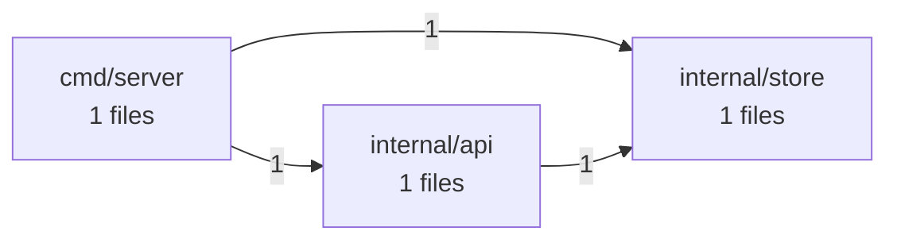

# Software X-Ray: go-service

> go-service: 3 critical/high finding(s) in Security, Technology Currency. Start there.

- **Target:** repository (`capybari-fixtures/go-service`)
- **Scan:** `scn_0d15989a3b3eba75` · 2026-09-24 05:02 UTC · 0.9s
- **Tool:** capybari 0136b2b
- **Mode:** online

## Scores

_All scores: 0 = worst, 100 = best._

| Dimension | Score | Rating | Confidence | Summary |
|---|---:|---|---|---|
| AI Dependability | **100** | good | low | No issues found by ai-signals. |
| Dependency Hygiene | **100** | good | high | No issues found by dependencies. |
| Technology Currency | **77** | fair | high | 1 high finding(s) by tech-detect. |
| Maintainability | **100** | good | high | No issues found by code-health. |
| Operability | **98** | good | high | 1 low finding(s) by fingerprint. |
| Security | **63** | fair | high | 2 high finding(s) by secrets, vulns. |
| Structure | **100** | good | high | No issues found by architecture. |

## What is it?

- **Project type:** application, web-backend
- **Primary language:** Go
- **Package managers:** Go modules
- **Runtimes:** Go 1.19
- **Entry points:** cmd/server/
- **Tests:** yes · **CI:** none · **Containers:** no · **Docs:** no
- **Size:** tiny · **Fingerprint:** `fp_0c1251ef491bd3718493`
- **Files:** 6 (85 lines) · **Languages:** Go 100%
- **Technologies:** Go 1.19, Gin 1.7.0
- **Dependencies:** 3 packages from 1 manifest(s), 3 direct

### Architecture

## Findings

Critical **0** · High **3** · Medium **0** · Low **1** · Info **0**

| Severity | Confidence | Dimension | Finding | Location | Capability |
|---|---|---|---|---|---|
| high | high | evolution | Go 1.19 is end-of-life |  | tech-detect |
| high | high | security | github.com/gin-gonic/gin 1.7.0 has 5 known vulnerabilities | `go.mod` | vulns |
| high | high | security | golang.org/x/text 0.3.5 has 5 known vulnerabilities | `go.mod` | vulns |
| low | high | operability | No README |  | fingerprint |

### Details

#### Go 1.19 is end-of-life `CSI-aebfe9feb75da0e0`

**high** severity · **high** confidence · evolution/end-of-life · found by `tech-detect`

Go 1.19 (release line 1.19) reached end-of-life on 2023-08-08. It no longer receives security fixes, so known vulnerabilities in it stay unpatched. Each Go release is supported until two newer major releases exist.

**Rule:** eol-go — https://endoflife.date/go

**Remediation:** Upgrade Go to a supported release line (see https://endoflife.date/go) and test the application against it.

_False positive?_ If the declared version is only a minimum (e.g. >=12) and production runs a newer release, update the declaration to match.

#### github.com/gin-gonic/gin 1.7.0 has 5 known vulnerabilities `CSI-7bcc538ccacbac9c`

**high** severity · **high** confidence · security/vulnerability · found by `vulns` (engine: OSV.dev)

- GHSA-h395-qcrw-5vmq (high, CVSS 7.1) CVE-2020-28483, GO-2021-0052: Inconsistent Interpretation of HTTP Requests in github.com/gin-gonic/gin
- GHSA-3vp4-m3rf-835h (medium, CVSS 5.6) CVE-2023-26125: Improper input validation in github.com/gin-gonic/gin
- GHSA-2c4m-59x9-fr2g (medium, CVSS 4.3) CVE-2023-29401, GO-2023-1737: Gin Web Framework does not properly sanitize filename parameter of Context.FileAttachment function
- GO-2021-0052 (medium) CVE-2020-28483, GHSA-h395-qcrw-5vmq: Inconsistent interpretation of HTTP Requests in github.com/gin-gonic/gin
- GO-2023-1737 (medium) CVE-2023-29401, GHSA-2c4m-59x9-fr2g: Improper handling of filenames in Content-Disposition HTTP header in github.com/gin-gonic/gin

- go.mod — resolves github.com/gin-gonic/gin 1.7.0

**Rule:** GHSA-h395-qcrw-5vmq — https://osv.dev/vulnerability/GHSA-h395-qcrw-5vmq, https://osv.dev/vulnerability/GHSA-3vp4-m3rf-835h, https://osv.dev/vulnerability/GHSA-2c4m-59x9-fr2g, https://osv.dev/vulnerability/GO-2021-0052, https://osv.dev/vulnerability/GO-2023-1737, https://nvd.nist.gov/vuln/detail/CVE-2020-28483

**Remediation:** Upgrade github.com/gin-gonic/gin to 1.9.1 or later and re-run the tests.

_False positive?_ Advisories match on version only. Check whether the vulnerable function is reachable in this application before deprioritising.

#### golang.org/x/text 0.3.5 has 5 known vulnerabilities `CSI-6b7027191989a3ed`

**high** severity · **high** confidence · security/vulnerability · found by `vulns` (engine: OSV.dev)

- GHSA-69ch-w2m2-3vjp (high, CVSS 7.5) CVE-2022-32149, GO-2022-1059: golang.org/x/text/language Denial of service via crafted Accept-Language header
- GHSA-ppp9-7jff-5vj2 (high, CVSS 7.5) CVE-2021-38561, GO-2021-0113: golang.org/x/text/language Out-of-bounds Read vulnerability
- GO-2021-0113 (medium) CVE-2021-38561, GHSA-ppp9-7jff-5vj2: Out-of-bounds read in golang.org/x/text/language
- GO-2022-1059 (medium) CVE-2022-32149, GHSA-69ch-w2m2-3vjp: Denial of service via crafted Accept-Language header in golang.org/x/text/language
- GO-2026-5970 (medium) CVE-2026-56852: Infinite loop on invalid input in golang.org/x/text

- go.mod — resolves golang.org/x/text 0.3.5

**Rule:** GHSA-69ch-w2m2-3vjp — https://osv.dev/vulnerability/GHSA-69ch-w2m2-3vjp, https://osv.dev/vulnerability/GHSA-ppp9-7jff-5vj2, https://osv.dev/vulnerability/GO-2021-0113, https://osv.dev/vulnerability/GO-2022-1059, https://osv.dev/vulnerability/GO-2026-5970, https://nvd.nist.gov/vuln/detail/CVE-2022-32149

**Remediation:** Upgrade golang.org/x/text to 0.39.0 or later and re-run the tests.

_False positive?_ Advisories match on version only. Check whether the vulnerable function is reachable in this application before deprioritising.

#### No README `CSI-e4020edf7aba62cb`

**low** severity · **high** confidence · operability/missing-readme · found by `fingerprint`

There is no README explaining what the project is, how to build it and how to run it.

**Rule:** no-readme

**Remediation:** Add a README with purpose, setup, build, test and deployment instructions.

## What else can we tell you?

1. **Add the deployed URL**: The repository shows the code. The deployed URL adds external exposure, TLS and security-header checks of what users actually reach.

## Capabilities run

| Capability | Status | Findings | Time | Network | Notes |
|---|---|---:|---:|---|---|
| AI-Generation Signals _(experimental)_ `ai-signals@0.1.0` | ok | 0 | 1ms | none | 0 AI assistant config(s), 0 builder marker(s), 0 scaffolding comment(s) |
| Architecture Mapper `architecture@0.1.0` | ok | 0 | 4ms | none | 3 modules, 3 internal dependencies, 0 cycle(s), 1 external packages |
| Code Health `code-health@0.1.0` | ok | 0 | 4ms | none | 4 functions in 3 files; avg complexity 1.3, max 2; 0.0% duplicated; 0 hotspot(s) |
| Dependency Inventory & SBOM `dependencies@0.1.0` | ok | 0 | 4ms | none | 3 packages (3 direct) from 1 manifest(s): Go 3 |
| Project Fingerprint `fingerprint@0.1.0` | ok | 1 | 1ms | none | application/web-backend project in Go on Go 1.19 |
| Repository Inventory `inventory@0.1.0` | ok | 0 | 1ms | none | 6 files, 85 lines, 1 languages (listed via walk) |
| Secret Scanner `secrets@0.1.0` | ok | 0 | 284ms | none | 0 potential secret(s) in 6 scanned files |
| Technology & Version Detector `tech-detect@0.1.0` | ok | 1 | 1ms | none | 2 technologies detected: Gin |
| Known Vulnerability Scanner `vulns@0.1.0` | ok | 2 | 629ms | required | 2 of 2 versioned packages have known vulnerabilities (10 advisories) |

## Artifacts

- `sbom.cdx.json` (application/vnd.cyclonedx+json, 2383 bytes) from dependencies

## Data boundary

Network requests were made to api.osv.dev by vulns. Source files were not uploaded; each disclosure states exactly what was sent.

- `vulns` → GET api.osv.dev ×10
- `vulns` → POST api.osv.dev ×1
- **vulns:** Sends package names, ecosystems and versions (never source code, file contents or paths) to api.osv.dev, the open vulnerability database operated by Google's Open Source Security Team.

## Limitations

- AI-Generation Signals: Experimental heuristics. These are indicators of unreviewed AI-generated output, not proof of AI use, and not a measure of quality on their own.
- Architecture Mapper: Dependencies are derived from static import statements; dynamic imports, dependency injection and reflection are not visible.
- Code Health: No git history available, so change hotspots could not be computed.
- Repository Inventory: No git metadata was available, so .gitignore rules were not applied; built-in exclusions were used instead.
- Secret Scanner: Only the current working tree was scanned. Secrets removed in earlier commits remain in git history and are not reported here.
- Secret Scanner: Secrets were not verified against provider APIs, so some may be revoked, test or example values.
- Technology & Version Detector: End-of-life data is bundled (as of 2026-09-23) so detection works offline; newer releases or policy changes after that date are not reflected.
- Known Vulnerability Scanner: Only dependencies with exact versions (from lockfiles) can be matched. Declared ranges without a lockfile are not checked.
- Automated analysis reports what its analyzers can detect. It does not certify software as secure or defect-free.

