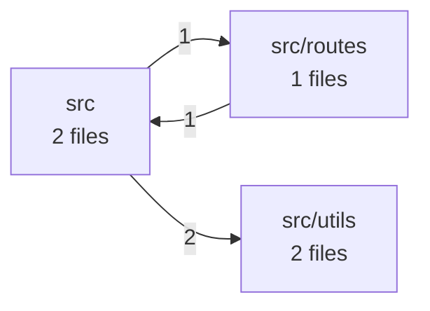

# Software X-Ray: node-express-legacy

> node-express-legacy: 6 critical/high finding(s) in Security, Technology Currency. Start there.

- **Target:** repository (`capybari-fixtures/node-express-legacy`)
- **Scan:** `scn_d31c674c1310bacb` · 2026-09-24 05:02 UTC · 1.0s
- **Tool:** capybari 0136b2b
- **Mode:** online

## Scores

_All scores: 0 = worst, 100 = best._

| Dimension | Score | Rating | Confidence | Summary |
|---|---:|---|---|---|
| AI Dependability | **100** | good | low | No issues found by ai-signals. |
| Dependency Hygiene | **100** | good | high | No issues found by dependencies. |
| Technology Currency | **75** | fair | high | 1 high, 1 low finding(s) by tech-detect. |
| Maintainability | **91** | good | high | 1 medium finding(s) by code-health, fingerprint. |
| Operability | **98** | good | high | 1 low finding(s) by fingerprint. |
| Security | **38** | poor | high | 5 high, 1 medium finding(s) by secrets, vulns. |
| Structure | **98** | good | high | 1 low finding(s) by architecture. |

## What is it?

- **Project type:** application, web-backend
- **Primary language:** JavaScript
- **Package managers:** npm
- **Runtimes:** Node.js 12.22.0
- **Entry points:** Dockerfile, src/server.js
- **Tests:** no · **CI:** none · **Containers:** yes · **Docs:** yes
- **Size:** tiny · **Fingerprint:** `fp_ced71e1056a9b8dc7247`
- **Files:** 10 (106 lines) · **Languages:** JavaScript 100%
- **Technologies:** MySQL 2.18.1, Docker, JavaScript, Lodash 4.17.15, Moment.js 2.29.1, Node.js 12.22.0, Express 4.16.0
- **Dependencies:** 8 packages from 1 manifest(s), 6 direct

### Architecture

## Findings

Critical **0** · High **6** · Medium **2** · Low **3** · Info **0**

| Severity | Confidence | Dimension | Finding | Location | Capability |
|---|---|---|---|---|---|
| high | high | evolution | Node.js 12 is end-of-life | `.nvmrc` | tech-detect |
| high | high | security | body-parser 1.18.2 has 2 known vulnerabilities | `package-lock.json` | vulns |
| high | high | security | jsonwebtoken 8.5.1 has 3 known vulnerabilities | `package-lock.json` | vulns |
| high | high | security | lodash 4.17.15 has 6 known vulnerabilities | `package-lock.json` | vulns |
| high | high | security | moment 2.29.1 has 2 known vulnerabilities | `package-lock.json` | vulns |
| high | high | security | qs 6.5.1 has 3 known vulnerabilities | `package-lock.json` | vulns |
| medium | high | maintainability | No automated tests found |  | fingerprint |
| medium | high | security | express 4.16.0 has 2 known vulnerabilities | `package-lock.json` | vulns |
| low | high | evolution | Moment.js is in maintenance mode |  | tech-detect |
| low | high | structure | Circular dependency between 2 modules | `src/utils/dates.js:2` (+1) | architecture |
| low | medium | operability | No CI/CD configuration found |  | fingerprint |

### Details

#### Node.js 12 is end-of-life `CSI-72e5af041d061823`

**high** severity · **high** confidence · evolution/end-of-life · found by `tech-detect`

Node.js 12.22.0 (release line 12) reached end-of-life on 2022-04-30. It no longer receives security fixes, so known vulnerabilities in it stay unpatched.

- .nvmrc — declares Node.js 12.22.0

**Rule:** eol-node.js — https://endoflife.date/nodejs

**Remediation:** Upgrade Node.js to a supported release line (see https://endoflife.date/nodejs) and test the application against it.

_False positive?_ If the declared version is only a minimum (e.g. >=12) and production runs a newer release, update the declaration to match.

#### body-parser 1.18.2 has 2 known vulnerabilities `CSI-415b080a05e77b70`

**high** severity · **high** confidence · security/vulnerability · found by `vulns` (engine: OSV.dev)

Transitive dependency. - GHSA-qwcr-r2fm-qrc7 (high, CVSS 7.5) CVE-2024-45590: body-parser vulnerable to denial of service when url encoding is enabled
- GHSA-v422-hmwv-36x6 (low, CVSS 3.7) CVE-2026-12590: body-parser vulnerable to denial of service when invalid limit value silently disables size enforcement

- package-lock.json — resolves body-parser 1.18.2

**Rule:** GHSA-qwcr-r2fm-qrc7 — https://osv.dev/vulnerability/GHSA-qwcr-r2fm-qrc7, https://osv.dev/vulnerability/GHSA-v422-hmwv-36x6, https://github.com/expressjs/body-parser/security/advisories/GHSA-qwcr-r2fm-qrc7

**Remediation:** Upgrade body-parser to 1.20.6 or later and re-run the tests.

_False positive?_ Advisories match on version only. Check whether the vulnerable function is reachable in this application before deprioritising.

#### jsonwebtoken 8.5.1 has 3 known vulnerabilities `CSI-fa93ef4fb80056c2`

**high** severity · **high** confidence · security/vulnerability · found by `vulns` (engine: OSV.dev)

- GHSA-8cf7-32gw-wr33 (high, CVSS 8.1) CVE-2022-23539: jsonwebtoken unrestricted key type could lead to legacy keys usage 
- GHSA-qwph-4952-7xr6 (medium, CVSS 6.4) CVE-2022-23540: jsonwebtoken vulnerable to signature validation bypass due to insecure default algorithm in jwt.verify()
- GHSA-hjrf-2m68-5959 (medium, CVSS 5.0) CVE-2022-23541: jsonwebtoken's insecure implementation of key retrieval function could lead to Forgeable Public/Private Tokens from RSA to HMAC

- package-lock.json — resolves jsonwebtoken 8.5.1

**Rule:** GHSA-8cf7-32gw-wr33 — https://osv.dev/vulnerability/GHSA-8cf7-32gw-wr33, https://osv.dev/vulnerability/GHSA-qwph-4952-7xr6, https://osv.dev/vulnerability/GHSA-hjrf-2m68-5959, https://github.com/auth0/node-jsonwebtoken/security/advisories/GHSA-8cf7-32gw-wr33

**Remediation:** Upgrade jsonwebtoken to 9.0.0 or later and re-run the tests.

_False positive?_ Advisories match on version only. Check whether the vulnerable function is reachable in this application before deprioritising.

#### lodash 4.17.15 has 6 known vulnerabilities `CSI-9fb8137425ae67da`

**high** severity · **high** confidence · security/vulnerability · found by `vulns` (engine: OSV.dev)

- GHSA-r5fr-rjxr-66jc (high, CVSS 8.1) CVE-2021-23337, CVE-2026-4800: lodash vulnerable to Code Injection via `_.template` imports key names
- GHSA-p6mc-m468-83gw (high, CVSS 7.4) CVE-2020-8203: Prototype Pollution in lodash
- GHSA-35jh-r3h4-6jhm (high, CVSS 7.2) CVE-2021-23337, CVE-2026-4800: Command Injection in lodash
- GHSA-f23m-r3pf-42rh (medium, CVSS 6.5) CVE-2025-13465, CVE-2026-2950: lodash vulnerable to Prototype Pollution via array path bypass in `_.unset` and `_.omit`
- GHSA-xxjr-mmjv-4gpg (medium, CVSS 6.5) CVE-2025-13465, CVE-2026-2950: Lodash has Prototype Pollution Vulnerability in `_.unset` and `_.omit` functions
- GHSA-29mw-wpgm-hmr9 (medium, CVSS 5.3) CVE-2020-28500: Regular Expression Denial of Service (ReDoS) in lodash

- package-lock.json — resolves lodash 4.17.15

**Rule:** GHSA-r5fr-rjxr-66jc — https://osv.dev/vulnerability/GHSA-r5fr-rjxr-66jc, https://osv.dev/vulnerability/GHSA-p6mc-m468-83gw, https://osv.dev/vulnerability/GHSA-35jh-r3h4-6jhm, https://osv.dev/vulnerability/GHSA-f23m-r3pf-42rh, https://osv.dev/vulnerability/GHSA-xxjr-mmjv-4gpg, https://github.com/lodash/lodash/security/advisories/GHSA-r5fr-rjxr-66jc

**Remediation:** Upgrade lodash to 4.18.0 or later and re-run the tests.

_False positive?_ Advisories match on version only. Check whether the vulnerable function is reachable in this application before deprioritising.

#### moment 2.29.1 has 2 known vulnerabilities `CSI-44d1d702ae6a3e6a`

**high** severity · **high** confidence · security/vulnerability · found by `vulns` (engine: OSV.dev)

- GHSA-8hfj-j24r-96c4 (high, CVSS 7.5) CVE-2022-24785: Path Traversal: 'dir/../../filename' in moment.locale
- GHSA-wc69-rhjr-hc9g (high, CVSS 7.5) CVE-2022-31129: Moment.js vulnerable to Inefficient Regular Expression Complexity

- package-lock.json — resolves moment 2.29.1

**Rule:** GHSA-8hfj-j24r-96c4 — https://osv.dev/vulnerability/GHSA-8hfj-j24r-96c4, https://osv.dev/vulnerability/GHSA-wc69-rhjr-hc9g, https://github.com/moment/moment/security/advisories/GHSA-8hfj-j24r-96c4

**Remediation:** Upgrade moment to 2.29.4 or later and re-run the tests.

_False positive?_ Advisories match on version only. Check whether the vulnerable function is reachable in this application before deprioritising.

#### qs 6.5.1 has 3 known vulnerabilities `CSI-e50428299df93fd0`

**high** severity · **high** confidence · security/vulnerability · found by `vulns` (engine: OSV.dev)

Transitive dependency. - GHSA-hrpp-h998-j3pp (high, CVSS 7.5) CVE-2022-24999: qs vulnerable to Prototype Pollution
- GHSA-4mjr-xmp4-gh2g (medium, CVSS 5.3) CVE-2026-82417: qs: Denial of Service via Attacker Controlled isBuffer
- GHSA-6rw7-vpxm-498p (low, CVSS 3.7) CVE-2025-15284: qs's arrayLimit bypass in its bracket notation allows DoS via memory exhaustion

- package-lock.json — resolves qs 6.5.1

**Rule:** GHSA-hrpp-h998-j3pp — https://osv.dev/vulnerability/GHSA-hrpp-h998-j3pp, https://osv.dev/vulnerability/GHSA-4mjr-xmp4-gh2g, https://osv.dev/vulnerability/GHSA-6rw7-vpxm-498p, https://nvd.nist.gov/vuln/detail/CVE-2022-24999

**Remediation:** Upgrade qs to 6.16.0 or later and re-run the tests.

_False positive?_ Advisories match on version only. Check whether the vulnerable function is reachable in this application before deprioritising.

#### No automated tests found `CSI-6b33a192b168d9e6`

**medium** severity · **high** confidence · maintainability/missing-tests · found by `fingerprint`

5 source files and no test files were found. Changes cannot be verified automatically, so every modification carries regression risk.

**Rule:** no-tests

**Remediation:** Start with tests around the most-changed and most business-critical code paths, and run them in CI.

_False positive?_ Tests stored outside the repository, or named without common test conventions, are not detected.

#### express 4.16.0 has 2 known vulnerabilities `CSI-c27328c722edc5d4`

**medium** severity · **high** confidence · security/vulnerability · found by `vulns` (engine: OSV.dev)

- GHSA-rv95-896h-c2vc (medium, CVSS 6.1) CVE-2024-29041: Express.js Open Redirect in malformed URLs
- GHSA-qw6h-vgh9-j6wx (medium, CVSS 5.0) CVE-2024-43796: express vulnerable to XSS via response.redirect()

- package-lock.json — resolves express 4.16.0

**Rule:** GHSA-rv95-896h-c2vc — https://osv.dev/vulnerability/GHSA-rv95-896h-c2vc, https://osv.dev/vulnerability/GHSA-qw6h-vgh9-j6wx, https://github.com/expressjs/express/security/advisories/GHSA-rv95-896h-c2vc

**Remediation:** Upgrade express to 4.20.0 or later and re-run the tests.

_False positive?_ Advisories match on version only. Check whether the vulnerable function is reachable in this application before deprioritising.

#### Moment.js is in maintenance mode `CSI-57c2a4e841593d6d`

**low** severity · **high** confidence · evolution/deprecated-library · found by `tech-detect`

The Moment.js maintainers consider it a legacy project and recommend Luxon, date-fns, Day.js or the Temporal API for new work.

**Rule:** deprecated-moment — https://momentjs.com/docs/#/-project-status/

**Remediation:** Plan a gradual migration to a maintained date library.

#### Circular dependency between 2 modules `CSI-e6a1f31c964f99b2`

**low** severity · **high** confidence · structure/dependency-cycle · found by `architecture`

src/utils/dates.js, src/utils/log.js depend on each other in a cycle. None of them can be changed, tested or extracted in isolation.

- src/utils/dates.js:2 — src/utils/dates.js → src/utils/log.js
- src/utils/log.js:1 — src/utils/log.js → src/utils/dates.js

**Rule:** dependency-cycle

**Remediation:** Break the cycle by moving the shared piece into a separate module both depend on, or invert one dependency through an interface or callback.

#### No CI/CD configuration found `CSI-dada79d1970fc26f`

**low** severity · **medium** confidence · operability/missing-ci · found by `fingerprint`

No pipeline definition (GitHub Actions, GitLab CI, Jenkins, CircleCI, Azure Pipelines, …) was found, so builds and tests are presumably run by hand.

**Rule:** no-ci

**Remediation:** Add a pipeline that builds, tests and scans every change.

_False positive?_ CI may be configured outside the repository (e.g. in a separate pipelines repository or a hosted service UI).

## What else can we tell you?

1. **Add the deployed URL**: The repository shows the code. The deployed URL adds external exposure, TLS and security-header checks of what users actually reach.

## Capabilities run

| Capability | Status | Findings | Time | Network | Notes |
|---|---|---:|---:|---|---|
| AI-Generation Signals _(experimental)_ `ai-signals@0.1.0` | ok | 0 | 2ms | none | 0 AI assistant config(s), 0 builder marker(s), 0 scaffolding comment(s) |
| Architecture Mapper `architecture@0.1.0` | ok | 1 | 4ms | none | 3 modules, 3 internal dependencies, 1 cycle(s), 4 external packages |
| Code Health `code-health@0.1.0` | ok | 0 | 1ms | none | 4 functions in 5 files; avg complexity 1.3, max 2; 0.0% duplicated; 0 hotspot(s) |
| Dependency Inventory & SBOM `dependencies@0.1.0` | ok | 0 | 2ms | none | 8 packages (6 direct) from 1 manifest(s): npm 8 |
| Project Fingerprint `fingerprint@0.1.0` | ok | 2 | 1ms | none | application/web-backend project in JavaScript on Node.js 12.22.0 |
| Repository Inventory `inventory@0.1.0` | ok | 0 | 3ms | none | 10 files, 106 lines, 1 languages (listed via walk) |
| Secret Scanner `secrets@0.1.0` | ok | 0 | 230ms | none | 0 potential secret(s) in 9 scanned files |
| Technology & Version Detector `tech-detect@0.1.0` | ok | 2 | 0ms | none | 7 technologies detected: Node.js, Express, MySQL, Docker, Lodash, Moment.js |
| Known Vulnerability Scanner `vulns@0.1.0` | ok | 6 | 806ms | required | 6 of 8 versioned packages have known vulnerabilities (18 advisories) |

## Artifacts

- `sbom.cdx.json` (application/vnd.cyclonedx+json, 5450 bytes) from dependencies

## Data boundary

Network requests were made to api.osv.dev by vulns. Source files were not uploaded; each disclosure states exactly what was sent.

- `vulns` → GET api.osv.dev ×18
- `vulns` → POST api.osv.dev ×1
- **vulns:** Sends package names, ecosystems and versions (never source code, file contents or paths) to api.osv.dev, the open vulnerability database operated by Google's Open Source Security Team.

## Limitations

- AI-Generation Signals: Experimental heuristics. These are indicators of unreviewed AI-generated output, not proof of AI use, and not a measure of quality on their own.
- Architecture Mapper: Dependencies are derived from static import statements; dynamic imports, dependency injection and reflection are not visible.
- Code Health: Function metrics for JavaScript use lexical heuristics, not a full parser; small deviations from compiler-accurate values are expected.
- Code Health: No git history available, so change hotspots could not be computed.
- Repository Inventory: No git metadata was available, so .gitignore rules were not applied; built-in exclusions were used instead.
- Secret Scanner: Only the current working tree was scanned. Secrets removed in earlier commits remain in git history and are not reported here.
- Secret Scanner: Secrets were not verified against provider APIs, so some may be revoked, test or example values.
- Technology & Version Detector: End-of-life data is bundled (as of 2026-09-23) so detection works offline; newer releases or policy changes after that date are not reflected.
- Known Vulnerability Scanner: Only dependencies with exact versions (from lockfiles) can be matched. Declared ranges without a lockfile are not checked.
- Automated analysis reports what its analyzers can detect. It does not certify software as secure or defect-free.

