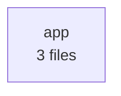

# Software X-Ray: python-flask-app

> python-flask-app: 5 critical/high finding(s) in Security, Technology Currency. Start there.

- **Target:** repository (`capybari-fixtures/python-flask-app`)
- **Scan:** `scn_d78ef6b6a67a122e` · 2026-09-24 05:02 UTC · 1.4s
- **Tool:** capybari 0136b2b
- **Mode:** online

## Scores

_All scores: 0 = worst, 100 = best._

| Dimension | Score | Rating | Confidence | Summary |
|---|---:|---|---|---|
| AI Dependability | **100** | good | low | No issues found by ai-signals. |
| Dependency Hygiene | **100** | good | high | No issues found by dependencies. |
| Technology Currency | **71** | fair | high | 1 high, 1 medium finding(s) by tech-detect. |
| Maintainability | **100** | good | high | No issues found by code-health. |
| Operability | **98** | good | high | 1 low finding(s) by fingerprint. |
| Security | **45** | poor | high | 4 high finding(s) by secrets, vulns. |
| Structure | **100** | good | high | No issues found by architecture. |

## What is it?

- **Project type:** application, web-backend
- **Primary language:** Python
- **Package managers:** pip
- **Runtimes:** Python 3.7.9
- **Entry points:** Dockerfile
- **Tests:** yes · **CI:** GitHub Actions · **Containers:** yes · **Docs:** no
- **Size:** tiny · **Fingerprint:** `fp_809e3ac961efa4ae855e`
- **Files:** 8 (74 lines) · **Languages:** Python 100%
- **Technologies:** Docker, Python 3.7.9, Requests 2.19.1, SQLAlchemy 1.3.0, Gunicorn 19.9.0, Jinja 2.10, Flask 1.0
- **Dependencies:** 5 packages from 1 manifest(s), 5 direct

### Architecture

## Findings

Critical **0** · High **5** · Medium **1** · Low **1** · Info **0**

| Severity | Confidence | Dimension | Finding | Location | Capability |
|---|---|---|---|---|---|
| high | high | evolution | Python 3.7 is end-of-life |  | tech-detect |
| high | high | security | Flask 1.0 has 4 known vulnerabilities | `requirements.txt` | vulns |
| high | high | security | Jinja2 2.10 has 12 known vulnerabilities | `requirements.txt` | vulns |
| high | high | security | gunicorn 19.9.0 has 4 known vulnerabilities | `requirements.txt` | vulns |
| high | high | security | requests 2.19.1 has 10 known vulnerabilities | `requirements.txt` | vulns |
| medium | high | evolution | Flask 1.0 is end-of-life | `requirements.txt` | tech-detect |
| low | high | operability | No README |  | fingerprint |

### Details

#### Python 3.7 is end-of-life `CSI-8e0c688fc67408f1`

**high** severity · **high** confidence · evolution/end-of-life · found by `tech-detect`

Python 3.7.9 (release line 3.7) reached end-of-life on 2023-06-27. It no longer receives security fixes, so known vulnerabilities in it stay unpatched.

**Rule:** eol-python — https://endoflife.date/python

**Remediation:** Upgrade Python to a supported release line (see https://endoflife.date/python) and test the application against it.

_False positive?_ If the declared version is only a minimum (e.g. >=12) and production runs a newer release, update the declaration to match.

#### Flask 1.0 has 4 known vulnerabilities `CSI-1787092ae47712cd`

**high** severity · **high** confidence · security/vulnerability · found by `vulns` (engine: OSV.dev)

- GHSA-m2qf-hxjv-5gpq (high, CVSS 7.5) CVE-2023-30861, PYSEC-2023-62: Flask vulnerable to possible disclosure of permanent session cookie due to missing Vary: Cookie header
- PYSEC-2026-2151 (medium, CVSS 4.3) CVE-2026-27205, GHSA-68rp-wp8r-4726: Flask is a web server gateway interface (WSGI) web application framework
- PYSEC-2023-62 (medium) CVE-2023-30861, GHSA-m2qf-hxjv-5gpq: Flask is a lightweight WSGI web application framework
- GHSA-68rp-wp8r-4726 (low) CVE-2026-27205, PYSEC-2026-2151: Flask session does not add `Vary: Cookie` header when accessed in some ways

- requirements.txt — resolves Flask 1.0

**Rule:** GHSA-m2qf-hxjv-5gpq — https://osv.dev/vulnerability/GHSA-m2qf-hxjv-5gpq, https://osv.dev/vulnerability/PYSEC-2026-2151, https://osv.dev/vulnerability/PYSEC-2023-62, https://osv.dev/vulnerability/GHSA-68rp-wp8r-4726, https://github.com/pallets/flask/security/advisories/GHSA-m2qf-hxjv-5gpq

**Remediation:** Upgrade Flask to 3.1.3 or later and re-run the tests.

_False positive?_ Advisories match on version only. Check whether the vulnerable function is reachable in this application before deprioritising.

#### Jinja2 2.10 has 12 known vulnerabilities `CSI-7ff2dc03c950e621`

**high** severity · **high** confidence · security/vulnerability · found by `vulns` (engine: OSV.dev)

- GHSA-462w-v97r-4m45 (high, CVSS 8.6) CVE-2019-10906, PYSEC-2019-217: Jinja2 sandbox escape via string formatting
- GHSA-q2x7-8rv6-6q7h (high, CVSS 7.8) CVE-2024-56326, PYSEC-2026-1475: Jinja has a sandbox breakout through indirect reference to format method
- PYSEC-2026-1475 (high, CVSS 7.8) CVE-2024-56326, GHSA-q2x7-8rv6-6q7h: Jinja has a sandbox breakout through indirect reference to format method
- GHSA-h5c8-rqwp-cp95 (medium, CVSS 5.4) CVE-2024-22195, PYSEC-2026-1473: Jinja vulnerable to HTML attribute injection when passing user input as keys to xmlattr filter
- GHSA-h75v-3vvj-5mfj (medium, CVSS 5.4) CVE-2024-34064, PYSEC-2026-1474: Jinja vulnerable to HTML attribute injection when passing user input as keys to xmlattr filter
- PYSEC-2026-1473 (medium, CVSS 5.4) CVE-2024-22195, GHSA-h5c8-rqwp-cp95: Jinja vulnerable to HTML attribute injection when passing user input as keys to xmlattr filter
- PYSEC-2026-1474 (medium, CVSS 5.4) CVE-2024-34064, GHSA-h75v-3vvj-5mfj: Jinja vulnerable to HTML attribute injection when passing user input as keys to xmlattr filter
- GHSA-g3rq-g295-4j3m (medium, CVSS 5.3) CVE-2020-28493, PYSEC-2021-66: Regular Expression Denial of Service (ReDoS) in Jinja2
- GHSA-cpwx-vrp4-4pq7 (medium) CVE-2025-27516, PYSEC-2026-1471: Jinja2 vulnerable to sandbox breakout through attr filter selecting format method
- PYSEC-2019-217 (medium) CVE-2019-10906, GHSA-462w-v97r-4m45: In Pallets Jinja before 2
- PYSEC-2021-66 (medium) CVE-2020-28493, GHSA-g3rq-g295-4j3m: This affects the package jinja2 from 0
- PYSEC-2026-1471 (medium) CVE-2025-27516, GHSA-cpwx-vrp4-4pq7: Jinja2 vulnerable to sandbox breakout through attr filter selecting format method

- requirements.txt — resolves Jinja2 2.10

**Rule:** GHSA-462w-v97r-4m45 — https://osv.dev/vulnerability/GHSA-462w-v97r-4m45, https://osv.dev/vulnerability/GHSA-q2x7-8rv6-6q7h, https://osv.dev/vulnerability/PYSEC-2026-1475, https://osv.dev/vulnerability/GHSA-h5c8-rqwp-cp95, https://osv.dev/vulnerability/GHSA-h75v-3vvj-5mfj, https://nvd.nist.gov/vuln/detail/CVE-2019-10906

**Remediation:** Upgrade Jinja2 to 3.1.6 or later and re-run the tests.

_False positive?_ Advisories match on version only. Check whether the vulnerable function is reachable in this application before deprioritising.

#### gunicorn 19.9.0 has 4 known vulnerabilities `CSI-33aa7a68f93efde4`

**high** severity · **high** confidence · security/vulnerability · found by `vulns` (engine: OSV.dev)

- GHSA-w3h3-4rj7-4ph4 (high, CVSS 8.2) CVE-2024-1135, PYSEC-2026-1434: Request smuggling leading to endpoint restriction bypass in Gunicorn
- PYSEC-2026-1434 (high, CVSS 8.2) CVE-2024-1135, GHSA-w3h3-4rj7-4ph4: Request smuggling leading to endpoint restriction bypass in Gunicorn
- GHSA-hc5x-x2vx-497g (high, CVSS 7.5) CVE-2024-6827, PYSEC-2026-1433: Gunicorn HTTP Request/Response Smuggling vulnerability
- PYSEC-2026-1433 (high, CVSS 7.5) CVE-2024-6827, GHSA-hc5x-x2vx-497g: Gunicorn HTTP Request/Response Smuggling vulnerability

- requirements.txt — resolves gunicorn 19.9.0

**Rule:** GHSA-w3h3-4rj7-4ph4 — https://osv.dev/vulnerability/GHSA-w3h3-4rj7-4ph4, https://osv.dev/vulnerability/PYSEC-2026-1434, https://osv.dev/vulnerability/GHSA-hc5x-x2vx-497g, https://osv.dev/vulnerability/PYSEC-2026-1433, https://nvd.nist.gov/vuln/detail/CVE-2024-1135

**Remediation:** Upgrade gunicorn to 22.0.0 or later and re-run the tests.

_False positive?_ Advisories match on version only. Check whether the vulnerable function is reachable in this application before deprioritising.

#### requests 2.19.1 has 10 known vulnerabilities `CSI-7259406d26fd5882`

**high** severity · **high** confidence · security/vulnerability · found by `vulns` (engine: OSV.dev)

- GHSA-x84v-xcm2-53pg (high, CVSS 7.5) CVE-2018-18074, PYSEC-2018-28: Insufficiently Protected Credentials in Requests
- GHSA-j8r2-6x86-q33q (medium, CVSS 6.1) CVE-2023-32681, PYSEC-2023-74: Unintended leak of Proxy-Authorization header in requests
- GHSA-9wx4-h78v-vm56 (medium, CVSS 5.6) CVE-2024-35195, PYSEC-2026-1873: Requests `Session` object does not verify requests after making first request with verify=False
- PYSEC-2026-1873 (medium, CVSS 5.6) CVE-2024-35195, GHSA-9wx4-h78v-vm56: Requests `Session` object does not verify requests after making first request with verify=False
- PYSEC-2026-2275 (medium, CVSS 5.5) CVE-2026-25645, GHSA-gc5v-m9x4-r6x2: Requests is a HTTP library
- GHSA-9hjg-9r4m-mvj7 (medium, CVSS 5.3) CVE-2024-47081, PYSEC-2026-1872: Requests vulnerable to .netrc credentials leak via malicious URLs
- PYSEC-2026-1872 (medium, CVSS 5.3) CVE-2024-47081, GHSA-9hjg-9r4m-mvj7: Requests vulnerable to .netrc credentials leak via malicious URLs
- GHSA-gc5v-m9x4-r6x2 (medium, CVSS 4.4) CVE-2026-25645, PYSEC-2026-2275: Requests has Insecure Temp File Reuse in its extract_zipped_paths() utility function
- PYSEC-2018-28 (medium) CVE-2018-18074, GHSA-x84v-xcm2-53pg: The Requests package before 2
- PYSEC-2023-74 (medium) CVE-2023-32681, GHSA-j8r2-6x86-q33q: Requests is a HTTP library

- requirements.txt — resolves requests 2.19.1

**Rule:** GHSA-x84v-xcm2-53pg — https://osv.dev/vulnerability/GHSA-x84v-xcm2-53pg, https://osv.dev/vulnerability/GHSA-j8r2-6x86-q33q, https://osv.dev/vulnerability/GHSA-9wx4-h78v-vm56, https://osv.dev/vulnerability/PYSEC-2026-1873, https://osv.dev/vulnerability/PYSEC-2026-2275, https://nvd.nist.gov/vuln/detail/CVE-2018-18074

**Remediation:** Upgrade requests to 2.33.0 or later and re-run the tests.

_False positive?_ Advisories match on version only. Check whether the vulnerable function is reachable in this application before deprioritising.

#### Flask 1.0 is end-of-life `CSI-d6b5d77d59b75c5f`

**medium** severity · **high** confidence · evolution/end-of-life · found by `tech-detect`

Flask 1.0 (release line 1.0) is no longer supported by its maintainers. It no longer receives security fixes, so known vulnerabilities in it stay unpatched. Pallets supports only the latest feature release.

- requirements.txt — declares Flask 1.0

**Rule:** eol-flask — https://flask.palletsprojects.com/en/stable/changes/

**Remediation:** Upgrade Flask to a supported release line (see https://flask.palletsprojects.com/en/stable/changes/) and test the application against it.

_False positive?_ If the declared version is only a minimum (e.g. >=12) and production runs a newer release, update the declaration to match.

#### No README `CSI-e4020edf7aba62cb`

**low** severity · **high** confidence · operability/missing-readme · found by `fingerprint`

There is no README explaining what the project is, how to build it and how to run it.

**Rule:** no-readme

**Remediation:** Add a README with purpose, setup, build, test and deployment instructions.

## What else can we tell you?

1. **Add the deployed URL**: The repository shows the code. The deployed URL adds external exposure, TLS and security-header checks of what users actually reach.

## Capabilities run

| Capability | Status | Findings | Time | Network | Notes |
|---|---|---:|---:|---|---|
| AI-Generation Signals _(experimental)_ `ai-signals@0.1.0` | ok | 0 | 2ms | none | 0 AI assistant config(s), 0 builder marker(s), 0 scaffolding comment(s) |
| Architecture Mapper `architecture@0.1.0` | ok | 0 | 6ms | none | 1 modules, 0 internal dependencies, 0 cycle(s), 0 external packages |
| Code Health `code-health@0.1.0` | ok | 0 | 6ms | none | 4 functions in 3 files; avg complexity 2.5, max 6; 0.0% duplicated; 0 hotspot(s) |
| Dependency Inventory & SBOM `dependencies@0.1.0` | ok | 0 | 7ms | none | 5 packages (5 direct) from 1 manifest(s): PyPI 5 |
| Project Fingerprint `fingerprint@0.1.0` | ok | 1 | 11ms | none | application/web-backend project in Python on Python 3.7.9 |
| Repository Inventory `inventory@0.1.0` | ok | 0 | 1ms | none | 8 files, 74 lines, 1 languages (listed via walk) |
| Secret Scanner `secrets@0.1.0` | ok | 0 | 267ms | none | 0 potential secret(s) in 8 scanned files |
| Technology & Version Detector `tech-detect@0.1.0` | ok | 2 | 1ms | none | 7 technologies detected: Flask, SQLAlchemy, Gunicorn, Docker, Jinja, Requests |
| Known Vulnerability Scanner `vulns@0.1.0` | ok | 4 | 1074ms | required | 4 of 5 versioned packages have known vulnerabilities (30 advisories) |

## Artifacts

- `sbom.cdx.json` (application/vnd.cyclonedx+json, 3410 bytes) from dependencies

## Data boundary

Network requests were made to api.osv.dev by vulns. Source files were not uploaded; each disclosure states exactly what was sent.

- `vulns` → GET api.osv.dev ×30
- `vulns` → POST api.osv.dev ×1
- **vulns:** Sends package names, ecosystems and versions (never source code, file contents or paths) to api.osv.dev, the open vulnerability database operated by Google's Open Source Security Team.

## Limitations

- AI-Generation Signals: Experimental heuristics. These are indicators of unreviewed AI-generated output, not proof of AI use, and not a measure of quality on their own.
- Architecture Mapper: Dependencies are derived from static import statements; dynamic imports, dependency injection and reflection are not visible.
- Code Health: Function metrics for Python use lexical heuristics, not a full parser; small deviations from compiler-accurate values are expected.
- Code Health: No git history available, so change hotspots could not be computed.
- Repository Inventory: No git metadata was available, so .gitignore rules were not applied; built-in exclusions were used instead.
- Secret Scanner: Only the current working tree was scanned. Secrets removed in earlier commits remain in git history and are not reported here.
- Secret Scanner: Secrets were not verified against provider APIs, so some may be revoked, test or example values.
- Technology & Version Detector: End-of-life data is bundled (as of 2026-09-23) so detection works offline; newer releases or policy changes after that date are not reflected.
- Known Vulnerability Scanner: Only dependencies with exact versions (from lockfiles) can be matched. Declared ranges without a lockfile are not checked.
- Automated analysis reports what its analyzers can detect. It does not certify software as secure or defect-free.

